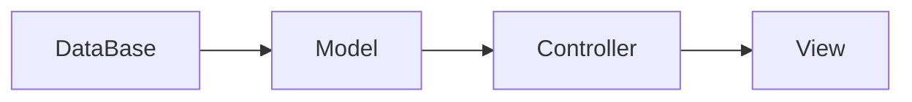
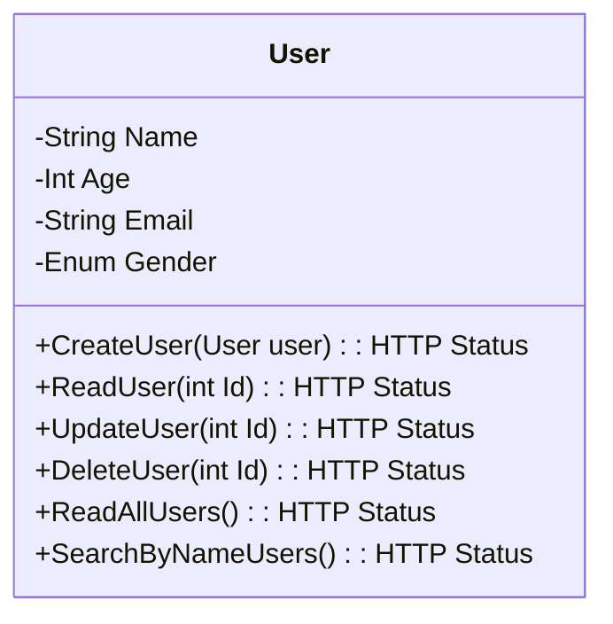

# UserManagerMVC
ASP.NET Core MVC

| RM | Nome |
|--|--|
| 94170 | Felipe Breno Sugisawa Altran|
| 93187 | Gabriel João da Silva|
| 94266 | Vinicius Alves Torres|
| 92895 | Vinicius Yuji Nishioka|
